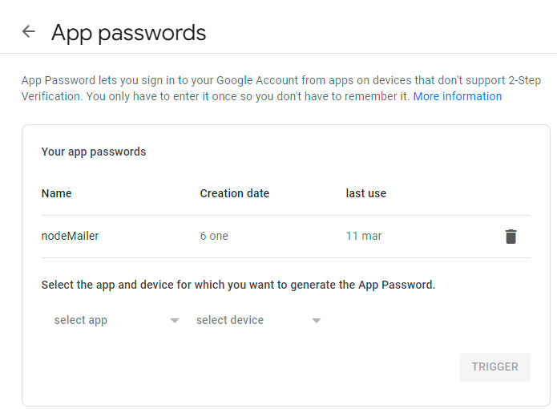
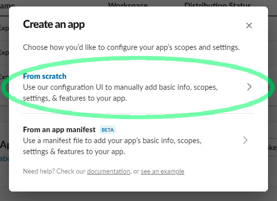
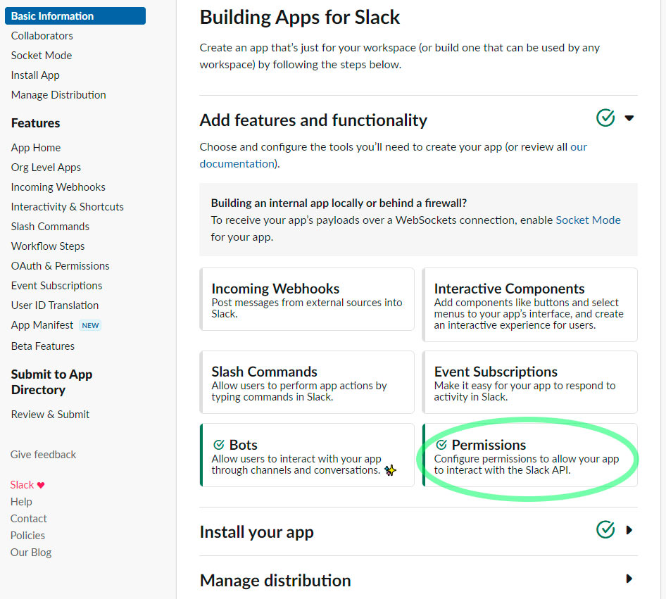
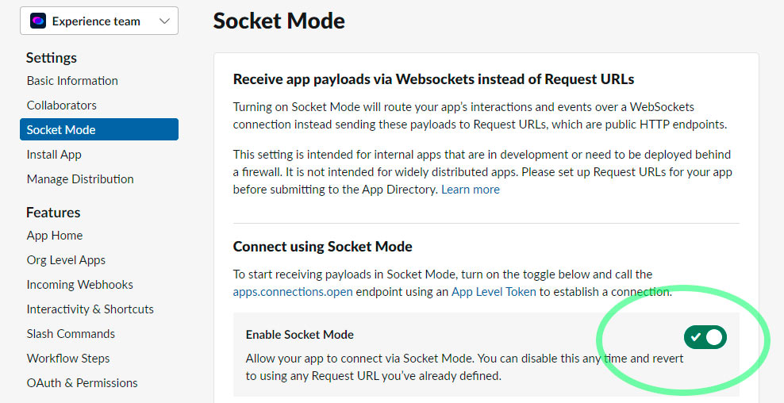
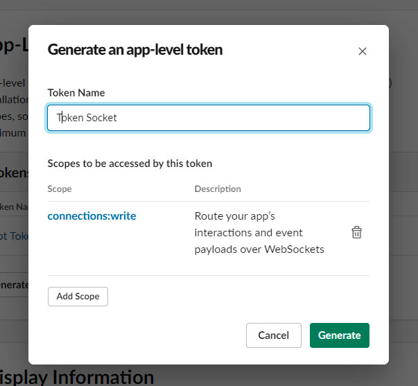
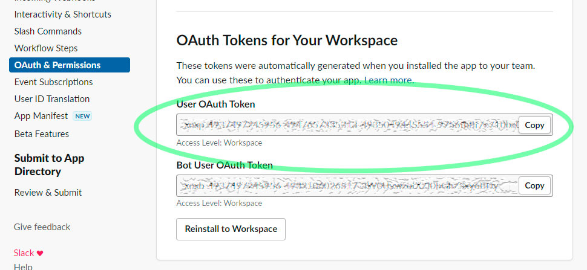

<a href="https://www.core-code.io/">

 </a>

<h1 align="center">Api</h1>

## Index

1. [Content](#1-content)
2. [Necessary programs](#2-necessary-programs)
3. [How to clone](#3-how-to-clone)
4. [Installation](#4-installation)
5. [Private keys](#5-private-keys)
6. [Run en producción](#6-run-en-producción)
7. [Slack app configuration](#7-slack-app-configuration)
---

This is the backend of the Core Code Platform system.

## 1. Content

Controller backend of our user frontend (student-app) and management frontend (management-app). The project is carried out in:

-   Node.js

-   express.js

-   sequelize (with Postgres database)

## 2. Necessary programs

To be able to use the project in localhost it is necessary to clone and have some programs:

- [Nodejs](https://nodejs.org/es/download/) v18.12.1 Higher.
- [PostgreSQL](https://www.postgresql.org/download/) PostgreSQL (can be optional, sequelize
    allows you to configure other databases).
- Development IDE of your convenience Example [VS Code](https://code.visualstudio.com/download)
- [PostMan](https://www.postman.com/downloads/) for APIS testing. (Optional)
- [Git](https://git-scm.com/downloads) to be able to manage the versions.

## 3. How to clone

As the project is in a workspaces we will clone everything:

```bash
cd existing_folder
git clone https://github.com/corecodeio/platform.git

```

## 4. Installation 

As the project is in a workspace we will install the dependencies of all the projects locating ourselves in the main directory or if we want only the backend positioning ourselves in "/api":

```bash
npm install
```

## 5. Private keys
We will create a file called .env positioned in "/api"

- Server configurations: these variables are for basic configuration and development mode.
    - SERVER_PORT: api project execution port
    - SERVER_MODE: variable to run development mode, should be filled with the value "dev" (if you use the console, it will display additional data when an endpoint is triggered and preload the information from the "development-data" folder to the database ).
    - SERVER_DEVELOPMENT: are the variables to customize the USER and PERSONNEL registry of the development mode. If these variables are not created, the user for development mode by default will be:
    ```json
    {
        "email" : "testing@gmail.com",
        "password" : "123456"
    }
    ```
```bash
    #Server configurations
    SERVER_PORT=3001
    SERVER_MODE=
    SERVER_DEVELOPMENT_FIRST_NAME=
    SERVER_DEVELOPMENT_LAST_NAME=
    SERVER_DEVELOPMENT_COUNTRY=
    SERVER_DEVELOPMENT_EMAIL=
    SERVER_DEVELOPMENT_PASSWORD=
    SERVER_DEVELOPMENT_PHONE=
    SERVER_DEVELOPMENT_SLACK_ID=
```

- Database configurations: These variables are for the connection to the database, the api project is configured to use Postgresql with the "sequelize" ORM.
```bash
    #Database configurations
    SERVER_DB_USER=
    SERVER_DB_PASS=
    SERVER_DB_HOST=
    SERVER_DB_PORT=
    SERVER_DB_NAME=
```

- Frontend configurations:: URLs needed to configure cors and email links.
```bash
    #Frontend configurations
    CLIENT_STUDENT_URL=http://localhost:3500
    CLIENT_MANAGEMENT_URL=http://localhost:4000
```

- Jsonwebtoken configuration: variables for creating tokens.
```bash
    #jwt configurations
    JWT_SECRET_KEY_STUDENT=
    JWT_EXPIRES_STUDENT=
    JWT_SECRET_KEY_MANAGEMENT=
    JWT_EXPIRES_MANAGEMENT=
```

- Nodemailer configurations: necessary for sending mail with the nodemailer library.
If you use a google mail the NODE_MAILER_HOST is "smtp.gmail.com" and its port is 587.
You can also avoid using your private email password by creating an application password:

```bash
    #nodemailer configurations
    NODE_MAILER_HOST=
    NODE_MAILER_PORT=
    NODE_MAILER_USER=
    NODE_MAILER_PASSWORD=
```

- Slack configurations: variable necessary for the socket connection of our slack app.
```bash
    #slack configurations
    SLACK_BOT_USER_OAUTH_TOKEN=
    SLACK_APP_LEVEL_TOKEN=
    SERVER_MODE_SLACK=
```

- Google calendar configuration: variable needed for connection with google api.
```bash
    #google configurations
    GOOGLE_CLIENT_ID=
    GOOGLE_SECRET_CLIENT=
    GOOGLE_REFRESH_TOKEN=
```

## 6. Run en producción:

Eliminate the "SERVER_MODE" key and change the others to those corresponding to the production environment.
When the keys are in production mode, execute the command:

```bash
npm run start
```
In case of being positioned in the central directory of the workspaces use:

```bash
npm run start:api
```

## 7. Slack app configuration

- In order to configure the SLACK environment variables, we must first create an application at https://api.slack.com/ and install it in our slack workspace.



- Before we can install the application we must create permissions.



### Bot Token Scopes
```
reactions:write
pins:write
groups:write
channels:manage
chat:write
users:write
im:write
files:write
im:read
mpim:read
groups:read
channels:read
users:read.email
reactions:read
im:history
mpim:history
groups:history
channels:history
app_mentions:read
users:read
team:read
usergroups:read
```

### User Token Scopes
```
admin.usergroups:write
channels:read
channels:write
files:write
groups:read
groups:write
im:write
mpim:read
mpim:write
pins:write
```

- Enable socket connection mode.



- We generate our application level token for the environment variable SLACK_APP_LEVEL_TOKEN.



- we copy the user Oauth Token to the environment variable SLACK_BOT_USER_OAUTH_TOKEN

